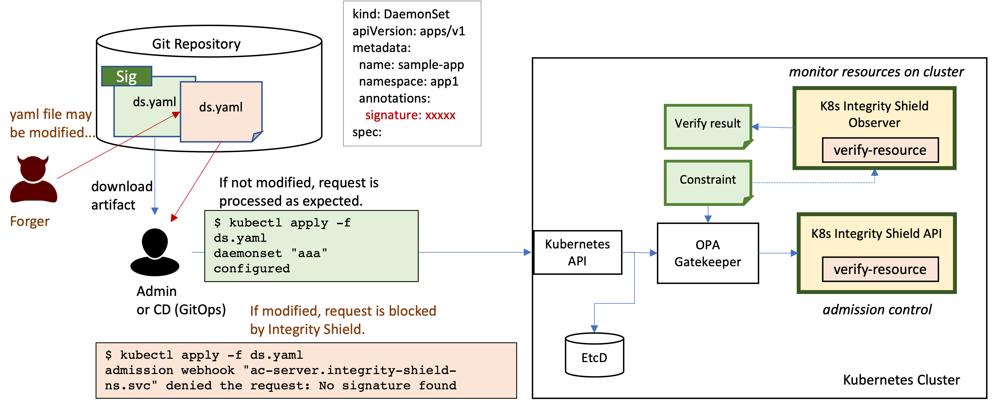

# integrity-shield
Integrity Shield is a tool for built-in preventive integrity control for regulated cloud workloads. It provides signature-based assurance of integrity for Kubernetes resources at cluster side.  

Integrity Shield works with [OPA/Gatekeeper](https://github.com/open-policy-agent/gatekeeper), verifies if the requests attached a signature, and blocks any unauthorized requests according to the constraint before actually persisting in etcd. 

Integrity Shield's capabilities are
- Allow to deploy authorized Kubernetes manifests only
- Zero-drift in resource configuration unless whitelisted
- Perform all integrity verification on cluster (admission controller, not in client side)
- Handle variations in application packaging and deployment (Helm /Operator /YAML / OLM Channel) with no modification in app installer
- Continuous resource monitoring



## How Integrity Shield works

### Protect Resources on cluster
Integrity shield api receives a k8s resource from OPA/Gatekeeper, validates the resource which is included in the admission request and sends the verification result to OPA/Gatekeeper.
Integrity shield api uses [k8s-manifest-sigstore](https://github.com/sigstore/k8s-manifest-sigstore) internally to verify k8s manifest.

You can define which resource to be protected in `ManifestIntegrityConstraint` which is a custom resource based on [constraint framework](https://open-policy-agent.github.io/gatekeeper/website/docs/howto/#constraints) of OPA/Gatekeeper.
For example, the following snippet shows an example definition of protected resources in a namespace. 
```yaml
apiVersion: constraints.gatekeeper.sh/v1beta1
kind: ManifestIntegrityConstraint
metadata:
  name: deployment-constraint
spec:
  match:
    kinds:
    - kinds: ["Deployment"]
      apiGroups: ["apps"]
    namespaces:
    - "sample-ns"
  parameters:
    constraintName: deployment-constraint
    action:
      admissionControl:
        enforce: true
      audit:
        inform: true
    objectSelector:
    - name: sample-app
    signers:
    - signer@signer.com
    ignoreFields:
    - objects:
      - kind: Deployment
      fields:
      - spec.replicas
```


### Monitor Kubernetes resource integrity on cluster
Integrity shield observer continuously verifies Kubernetes resource on cluster according ManifestIntegrityConstraint resources and exports the results to resources called ManifestIntegrityState.

For example, the following snippet shows an example of verify result based on deployment-constraint. You can see there is one invalid deployment resource in sample-ns.

```yaml
apiVersion: apis.integrityshield.io/v1
kind: ManifestIntegrityState
metadata:
  creationTimestamp: '2021-10-11T09:01:26Z'
  generation: 16
  labels:
    integrityshield.io/verifyResourceIgnored: 'false'
    integrityshield.io/verifyResourceViolation: 'true'
  name: deployment-constraint
  namespace: integrity-shield-operator-system
spec:
  constraintName: deployment-constraint
  nonViolations: null
  observationTime: '2021-10-11 10:16:27'
  totalViolations: 1
  violation: true
  violations:
    - apiGroup: apps
      apiVersion: v1
      kind: Deployment
      name: sample-app
      namespace: sample-ns
      result: 'failed to verify signature: failed to get signature: `cosign.sigstore.dev/message`
      is not found in the annotations'
```

### Quick Start
See [Quick Start](docs/README_QUICK.md)

## Supported Platforms

Integrity Shield can be deployed with operator. We have verified the feasibility on the following platforms:

[RedHat OpenShift 4.7.1 and 4.9.0](https://www.openshift.com)  
[Kind Cluster v1.19.7 and v1.21.1](https://kind.sigs.k8s.io)