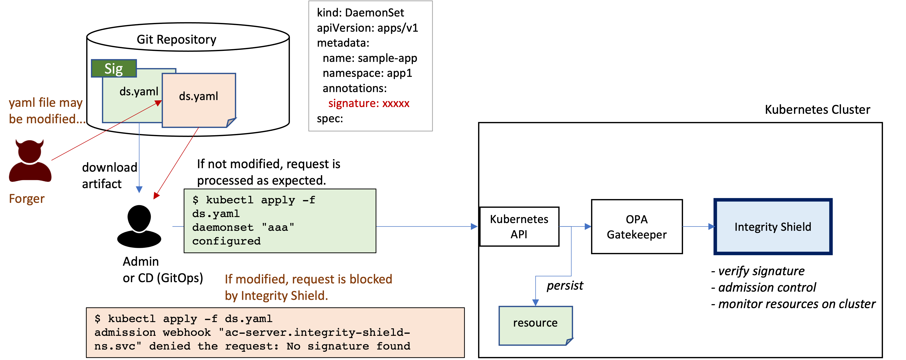

# integrity-shield
Integrity Shield is a tool for built-in preventive integrity control for regulated cloud workloads. It provides signature-based assurance of integrity for Kubernetes resources at cluster side.  

Integrity Shield works with OPA/Gatekeeper, verifies if the requests attached a signature, and blocks any unauthorized requests according to the constraint before actually persisting in etcd. 
Also, you can use the [admission controller](./webhook/admission-controller/README.md) instead of OPA/Gatekeeper.



## integrity shield api

Integrity shield api includes the main logic to verify admission requests. 
Integrity shield api receives a k8s resource from OPA/Gatekeeper, validates the resource which is included in the admission request based on the profile and sends the verification result to OPA/Gatekeeper.
Integrity shield api uses [k8s-manifest-sigstore](https://github.com/sigstore/k8s-manifest-sigstore) internally to verify k8s manifest.

You can enable the protection by integrity shield with a few simple steps.
Please see [Usage](./shield/README.md).

## gatekeeper constraint
Integrity shield works with OPA/Gatekeeper by installing ConstraintTemplate(`template-manifestintegrityconstraint.yaml` ).
We use [constraint framework](https://open-policy-agent.github.io/gatekeeper/website/docs/howto/#constraints) of OPA/Gatekeeper to define the resources to be protected.

For example, the following snippet shows an example definition of protected resources in a namespace. 
```
apiVersion: constraints.gatekeeper.sh/v1beta1
kind: ManifestIntegrityConstraint
metadata:
  name: deployment-constraint
spec:
  match:
    kinds:
    - kinds: ["Deployment"]
      apiGroups: ["apps"]
    namespaces:
    - "sample-ns"
  parameters:
    inScopeObjects:
    - name: sample-app
    signers:
    - signer@signer.com
    ignoreFields:
    - objects:
      - kind: Deployment
      fields:
      - spec.replicas
```
`ManifestIntegrityConstraint` resource includes the parameters field. In the parameters field, you can configure the profile for verifying resources such as ignoreFields for allowing some requests that match this rule, signers, and so on.

## admission controller
This is an admission controller for verifying k8s manifest with sigstore signing. You can use this admission controller instead of OPA/Gatekeeper.
In this case, you can decide which resources to be protected in the custom resource called `ManifestIntegrityProfile` instead of OPA/Gatekeeper constraint.

The following snippet is an example of `ManifestIntegrityProfile`.
```
apiVersion: apis.integrityshield.io/v1alpha1
kind: ManifestIntegrityProfile
metadata:
  name: profile-configmap
spec:
  match:
    kinds:
    - kinds:
      - ConfigMap
    namespaces:
    - sample-ns
  parameters:
    ignoreFields:
    - fields:
      - data.comment
      objects:
      - kind: ConfigMap
    signers:
    - signer@signer.com
```

You can set up the admission controller with a few simple steps. Please see [admission controller](./webhook/admission-controller/README.md).

