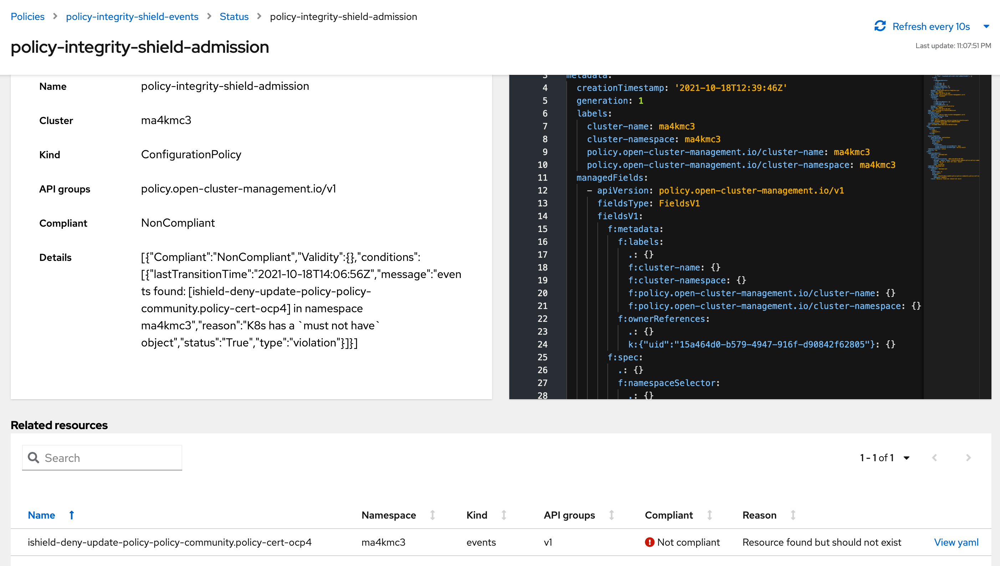

# Getting Started
Let’s take a look at how to install K8s Integrity Shield by using custom policy with RHACM and how Integrity Shield protects RHACM policies with PGP signature.

### STEP 0. Prerequisite
#### OPA/Gatekeeper

Before the installation, Gatekeeper should be installed on the cluster. Gatekeeper is also integrated with Red Hat Advanced Cluster Management, so it can be installed by using [this policy](https://github.com/open-cluster-management/policy-collection/blob/main/stable/CM-Configuration-Management/policy-gatekeeper-operator-downstream.yaml).

#### Verification Key Setup
You need to have a GPG key pair for signing and verifying signature, and you need to deploy key as keyring-secret secret resource on all target clusters. See [this instruction](https://github.com/open-cluster-management/integrity-shield/blob/master/docs/ACM/README_SETUP_KEY_RING_ACM_ENV.md). 

### STEP 1. Enable Custom Policy On Target Clusters
We use three custom policies in the policy-collection repository on GitHub to enable Integrity Shield: policy-integrity-shield.yaml, policy-integrity-shield-observer.yaml and policy-integrity-shield-events.yaml.

By default, these policies are deployed in inform mode. 
The custom policy `policy-integrity-shield.yaml` for deploying K8s Integrity Shield should be configured to enable K8s Integrity Shield on target clusters:
- Set remediationAction in the following specification to enforce (changed from inform)
```yaml
apiVersion: policy.open-cluster-management.io/v1
kind: Policy
metadata:
  name: policy-integrity-shield
  annotations:
    policy.open-cluster-management.io/standards: NIST SP 800-53
    policy.open-cluster-management.io/categories: CM Configuration Management
    policy.open-cluster-management.io/controls: CM-5 Access Restrictions for Change
spec:
  remediationAction: inform  #CHANGE THIS WHEN ENABLED
  disabled: false
```
The rule to protect RHACM policies in `detect` mode is also installed by the custom policy `policy-integrity-shield.yaml`. Therefore, after installing these policies, the signature based protection for policies is enabled.

### STEP 2. Check cluster integrity on RHACM console

If there are any non-compliant constraints, they will be listed in the RHACM console.
You can check the cluster integrity from RHACM console quickly.

The RHACM policies don't have signature initially, so `policy-integrity-shield-observer`, which reports there are any invalid resources on the target clusters, will be not-compliant state when you enable install Integrity Shield.


By moving to the page that displays the details of policy-integrity-shield-observer, you can check in detail which policy does not have a signature.
In the following example, there are four policies that are not signed.


### STEP 3. Sign All Policies
Let's attach signature to all unsigned policies.
The following example shows how to sign a policy file policy-xxxxx.yaml with the key of signer signer@enterprise.com. You can use this [script](https://github.com/open-cluster-management/integrity-shield/blob/master/scripts/gpg-annotation-sign.sh) to sign a policy.
```
# CAUTION: Specified YAML file is modified with new signature
./gpg-annotation-sign.sh signer@enterprise.com policy-xxxxx.yaml
```
Digital signature provides cryptographic assurance for protecting the integrity of data. Signature protects the integrity of the resource. YAML content is signed, as you can see in the following Policy annotations, and an encoded signature value is attached to the resource:
```yaml
apiVersion: policy.open-cluster-management.io/v1
kind: Policy
metadata:
  annotations:
    policy.open-cluster-management.io/categories: SC System and Communications Protection
    policy.open-cluster-management.io/controls: SC-12 Cryptographic Key Establishment and Management
    policy.open-cluster-management.io/standards: NIST SP 800-53
    integrityshield.io/message: H4sIAC5xbWEAA91XS2/bMAy+...
    integrityshield.io/signature: LS0tLS1CRUdJTiBQR1AgU0lHT...
  name: policy-cert-ocp4
spec:
```
Then, sync the signed policies.
After a while, the policy-integrity-shield-observer will be compliant status because all policies on target clusters have valid signature.


### STEP 4. Enable enforce mode
We confirmed that all policies on the cluster are valid state now, so let's enable enforce mode.

To switch to enforce mode, change `action.mode` field to `enforce` in `policy-integrity-shield.yaml`. 
 <div align="center">
    <br/>
</div>
<!--  -->

After the change is applied, K8s Integrity Shield blocks any request without a signature to create and update resources specified in profiles. 
In enforce mode, Integrity Shield generates Event resource to report that invalid request happened on the cluster.
For example, the following error is reported when a change of policy is requested without signature: 



In order to update the policy, you will need to regenerate the signature for the updated policy, following the same procedure as in step 3.