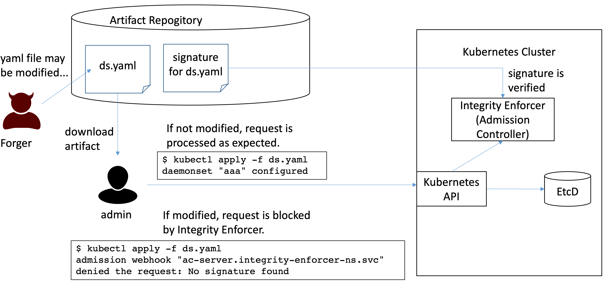

# Overview
## Goal
​
The goal of Integrity Enforcer is to provide assurance of the integrity of Kubernetes resources.

Integrity Enforcer is a tool for built-in preventive integrity control for regulated cloud workloads. It includes signature based configuration drift prevention based on [Admission Webhook](https://kubernetes.io/docs/reference/access-authn-authz/admission-controllers/) on Kubernetes cluster.
​
Resources on a Kubernetes cluster are defined in various form of artifacts such as YAML files, Helm charts, Operator, etc., but those artifacts may be altered maliciously or unintentionally before deploying them to cluster.
This could be an integrity issue. For example, some artifact may be modified to inject malicous scripts and configurations inside in stealthy manner, then admininstrator may be in risk of deploying it without knowing the falsification.

Integrity Enforcer (IE) provides signature-based assurance of integrity for Kubernetes resources at cluster side. IE works as an Admission Controller which handles all incoming Kubernetes admission requests, verifies if the requests attached a signature, and blocks any unauthorized requests according to the enforce policy before actually persisting in etcd. IE will helps cluster adminstrator to ensure
- Allow to deploy authorized application pakcages only
- Allow to use signed deployment params only
- Zero-drift in resource configuration unless allowed explicitly
- Perform all integrity verification on cluster (admission controller, not in client side)
- Handle variations in application packaging and deployment (Helm /Operator /YAML / OLM Channel) with no modification in app installer

​


## Supported Platforms
​
Integrity Enforcer works as Kubernetes Admission Controller using Mutating Admission Webhook, and it can run on any Kubernetes cluster by design.
IE can be deployed with operator. We have verified the feasibility on the following platforms:
​
- [RedHat OpenShift 4.5](https://www.openshift.com/)
- [RedHat OpenShift 4.3 on IBM Cloud (ROKS)](https://www.openshift.com/products/openshift-ibm-cloud)
- [IBM Kuberenetes Service (IKS)](https://www.ibm.com/cloud/container-service/) 1.17.12
- [Minikube v1.18.2](https://kubernetes.io/docs/setup/learning-environment/minikube/)
​

## How Integrity Enforcer works
- Resources to be protected in each namespace can be defined in the custom resource called `ResourceSigningProfile`. For example, the following snippet shows an example definition of protected resources in a namespace. This `ResourceSigningProfile` resource includes the matching rule for specifiying resources to such as ConfigMap, Depoloyment, and Service in a namespace `secure-ns`, which is protected by IE, so any matched request to create/update those resources are verified with signature.  (see [Define Protected Resources](README_FOR_RESOURCE_PROTECTION_PROFILE.md))
​
  ```yaml
  apiVersion: research.ibm.com/v1alpha1
  kind: ResourceSigningProfile
  metadata:
    name: sample-rsp
  spec:
    rules:
    - match:
      - namespace: secure-ns
        kind: ConfigMap
      - namespace: secure-ns
        kind: Deployment
      - namespace: secure-ns
        kind: Service
  ```
​
- Adminssion request to the protected resources is blocked at Mutating Admission Webhook, and the request is allowed only when the valid signature on the resource in the request is provided.
- Signer can be defined for each namespace independently. Signer for cluster-scope resources can be also defined. (see [Sign Policy](README_CONFIG_SIGNER_POLICY.md).)
- Signature is provided in the form of separate signature resource or annotation attached to the resource. (see [How to Sign Resources](README_RESOURCE_SIGNATURE.md))
- Integrity Enforcer admission controller is installed in a dedicated namespace (e.g. `integrity-enforcer-ns` in this document). It can be installed by operator. (see [Integrity Enforcer Custom Resource](README_IE_OPERATOR_CR.md) for detail install options.)
​