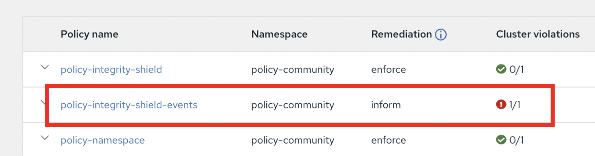
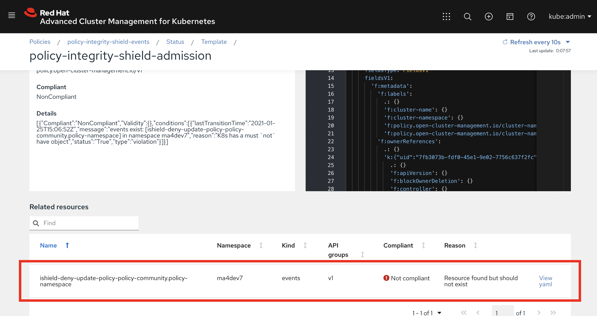
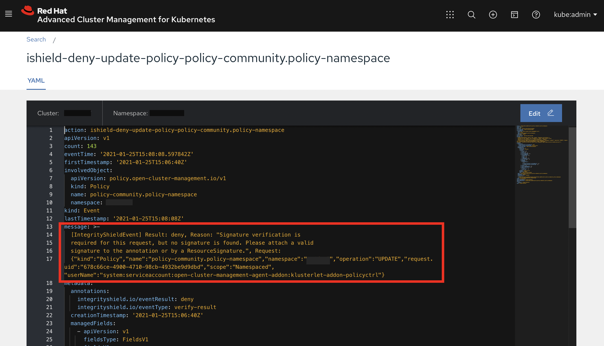

# How to show Integrity Shield status in an ACM console.

The document describes how to show a status of integrity with Integrity Shield in an ACM Multi Cloud Console. It enables you to easily see if Integrity Shield has denied any request or not, and the status on the UI will be changed to `Not Compliant` when a deny event happened in a managed cluster.

## Just 3 Steps to enable integrity status with Integrity Shield

To make an Integrity Shield status visible in ACM Web Console, the only one action is required, which is creating a policy.

The following describes how to create the policy only in 3 steps.


### Create the ACM policy called `policy-integrity-shield-events` in the ACM hub cluster.
   
  You will use the ACM policy called `policy-integrity-shield-events`, which is specified in [policy-integrity-shield-events.yaml](https://github.com/stolostron/policy-collection/blob/master/community/CM-Configuration-Management/policy-integrity-shield-events.yaml), and the following describes how to create this policy on your ACM hub cluster.
   
  1. Retrieve the source from [policy-collection](https://github.com/stolostron/policy-collection) Git repository.
   
      Following the [installation doc](../README_ENABLE_ISHIELD_PROTECTION_ACM_ENV.md), a forked repository of [policy-collection](https://github.com/stolostron/policy-collection) should be ready on your machine. (Otherwise, please finish it before this doc.)

      You can find `policy-integrity-shield-events.yaml` in the directory `community/CM-Configuration-Management/`.

      ---
      `Optional Step) Configure the placement rule`

      The [PlacementRule](https://github.com/stolostron/policy-collection) in `policy-integrity-shield-events.yaml` determines which ACM managed clusters Integrity Shield should be deployed. 

      If you would like to use your own PlacementRule instead of the default one, please configure it.

      By default, `policy-integrity-shield.yaml-events` includes a `PlacementRule` as shown in the following example. 

      ```
         apiVersion: apps.open-cluster-management.io/v1
         kind: PlacementRule
         metadata:
           name: placement-policy-integrity-shield
         spec:
           clusterConditions:
           - status: "True"
             type: ManagedClusterConditionAvailable
           clusterSelector:
             matchExpressions:
             - {key: environment, operator: In, values:   ["dev"]}
      ```   
      The above `PlacementRule` configures that Integrity Shield to be deployed to an ACM managed cluster(s) with tags: 
        - key: `environment` 
        - values: `dev`

  2. Sign `policy-integrity-shield-events.yaml`

     Here is the example when you sign the policy `policy-integrity-shield-events.yaml` with the key of signer signer@enterprise.com:

     ```
     curl -s  https://raw.githubusercontent.com/stolostron/integrity-shield/master/scripts/gpg-annotation-sign.sh | bash -s \
              signer@enterprise.com \
              policy-integrity-shield-events.yaml
     ```

     - This script will modify the original file. If you would like to keep the original file, keep a backup of the file before signing.
     - You need to create new signature whenever you change policy and apply it to clusters. Otherwise, the change will be blocked and not applied.


  3. Deploy `policy-integrity-shield-events` on an ACM managed cluster (via GitOps).
  
      a)  Commit your `policy-integrity-shield-events.yaml` to your `policy-collection` repository 
      
      b)  Create `policy-integrity-shield-events` in the ACM hub cluster in the same namespace as the namespace of `policy-integrity-shield`.

      Connect to the ACM Hub cluster and execute the following script with the following parameters:
        - `https://github.com/YOUR-ORG-NAME/policy-collection.git` -  The URL for the forked `policy-collection` GitHub repository.
        - `community` - The directory where `policy-integrity-shield-events.yaml` is located.
        - `policy-community` - The namespace for creating policy

      ```
        $ cd policy-collection/deploy
        $ bash ./deploy.sh -u https://github.com/<YOUR-ORG-NAME>/policy-collection.git -p community -n policy-community
      ``` 

      When the ACM GitOps successfully synced up, the policy `policy-integrity-shield-events` will be created in an ACM managed cluster(s) which are selected based on the placement rule in the policy. 
      
      Then, please confirm the status (i.e., Compliance) of `policy-integrity-shield-events` in the ACM Multicloud web console (Governance and Risk).
      
      Compliance status of `policy-integrity-shield-events` represents an existence of `deny` event in a cluster.

      When Integrity Shield denies a Kubernetes resource request, it reports a corresponding event as Kubernetes Event. This policy is checking existence of this kind of Integrity Shield Event, and if there is one or more events, it shows `Not Compliant` in the web console.

      

      When you have deployed Integrity Shield itself and this `policy-integrity-shield-events` at the same time, it should show `Compliant` on the status right after installation. 


## Check a detail of denied events via ACM Console

When you find `Not Compliant` status on this policy, you can see the reason why the deny event was happened via ACM Web Console.

Clicking `Status` tab in the `policy-integrity-shield-events`, you will see this kind of page with `Not Compliant` report.



The area with red rectangle in this image shows what event was happened against this policy, and you can see detail of the event by clicking `View yaml` link.

This page shows the detail of denied events, and you can check which resource, who requested, what was missing, how you can remediate it, and so on.



For example, the event in the above image describes something like following
- an attempt to update a policy named `policy-community.policy-namespace` was failed because a signature was not found, so please attach it for passing verification of this request.

